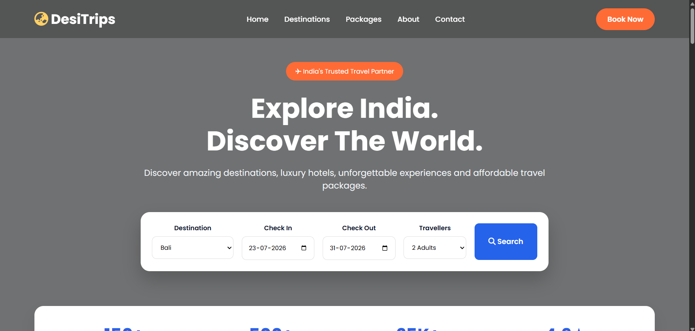

# 🌍 DesiTrips – Travel & Tourism Website

A modern, responsive travel website built using **HTML, CSS, and JavaScript** as part of the **ApexPlanet Web Development Internship – Task 1**.

DesiTrips is designed to help users explore popular destinations, discover travel packages, and simulate a basic travel booking experience through an interactive search form.

---

## 🚀 Live Demo

https://siddhantrajgit.github.io/DesiTrips/

---

## 📸 Preview



---

## ✨ Features

- 🌍 Modern travel website UI
- 📱 Fully Responsive Design
- 🧭 Easy Navigation
- 🔍 Travel Search Form
- 🏖 Popular Destinations Section
- ✈ Trending Tour Packages
- ⭐ Customer Testimonials
- 🖼 Travel Gallery
- 📧 Newsletter Subscription Section
- 📞 Contact & Footer Section
- 💻 Basic JavaScript Interactivity
- 🎨 Clean and Modern Design

---

## 🛠 Technologies Used

- HTML5
- CSS3
- JavaScript (Vanilla JS)
- Google Fonts
- Font Awesome

---

## 📂 Project Structure

```
DesiTrips/
│
├── index.html
├── style.css
├── script.js
├── README.md
│
└── images/
    ├── hero.jpg
    ├── goa.jpg
    ├── manali.jpg
    ├── kerala.jpg
    ├── jaipur.jpg
    ├── bali.jpg
    ├── dubai.jpg
    ├── gallery1.jpg
    ├── gallery2.jpg
    ├── gallery3.jpg
    ├── gallery4.jpg
    ├── gallery5.jpg
    ├── gallery6.jpg
    ├── user1.jpg
    ├── user2.jpg
    └── user3.jpg
```

---

## ⚙️ How to Run

1. Download or Clone the repository

```bash
git clone https://github.com/siddhantrajgit/DesiTrips.git
```

2. Open the project folder.

3. Open **index.html** in your browser.

No additional setup is required.

---

## 📚 Learning Objectives

This project demonstrates:

- Semantic HTML
- Responsive CSS
- CSS Grid
- Flexbox
- Hover Effects
- Basic JavaScript
- Form Inputs
- DOM Manipulation
- Event Handling

---

## 🎯 Future Improvements

- Online Booking System
- Login & Signup
- Payment Gateway
- Destination Filters
- Search Functionality
- Dark Mode
- Travel Blog
- Weather API
- Google Maps Integration

---

## 👨‍💻 Developed By

**Siddhant Raj**

B.Tech CSE Student

Frontend Developer

---

## 📬 Contact

GitHub:
https://github.com/siddhantrajgit

LinkedIn:
https://www.linkedin.com/in/siddhant-raj-7ab257250/

Email:
siddhantraj284@gmail.com

---

## ⭐ If you like this project

Give it a ⭐ on GitHub!

---

## 📄 License

This project is created for educational and internship purposes.

MIT License.
